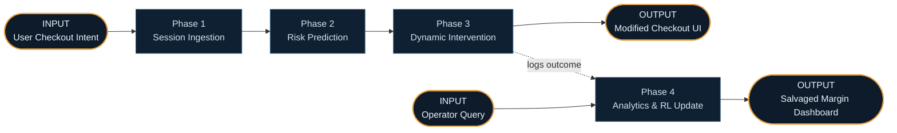
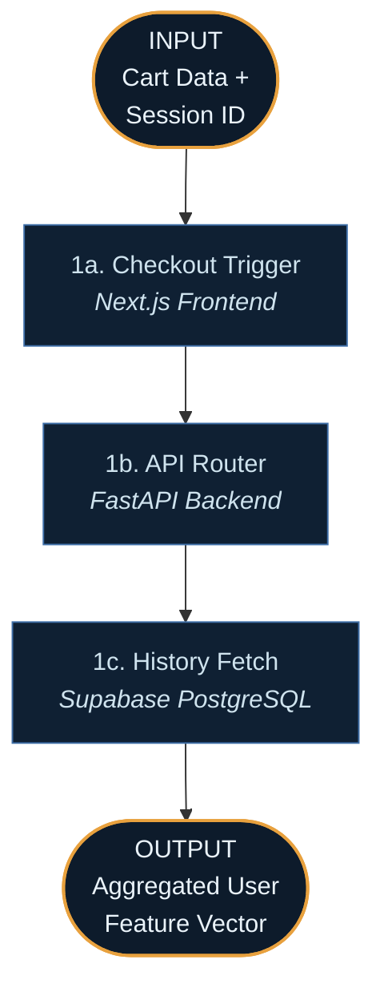
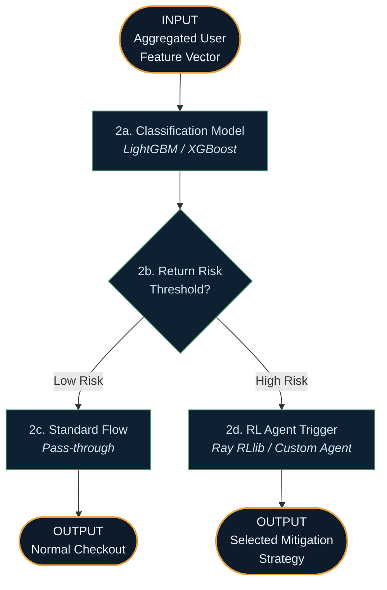
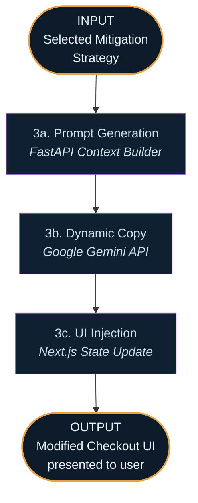
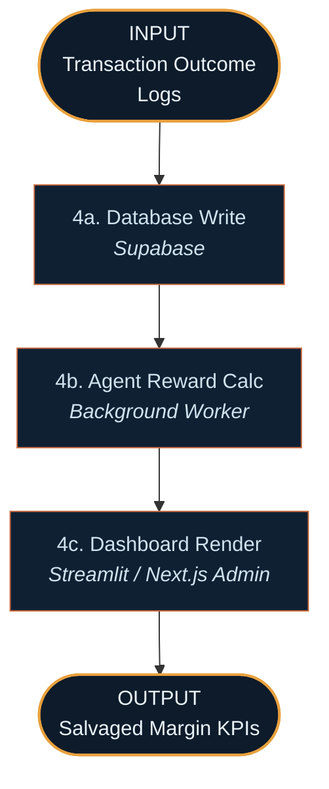
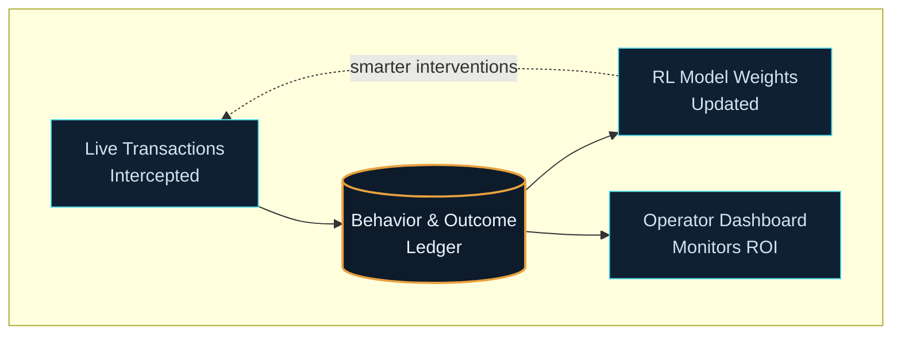

# AI for Retail Intelligence: Reverse Logistics Optimization Brain — System Walkthrough

This document traces how the platform behaves in practice — from the moment a user begins a checkout process, through real-time risk prediction, to the moment an intervention is served and the system learns from the outcome. Each phase below has a Mermaid diagram directly beneath its heading, with explicit **INPUT** and **OUTPUT** nodes so you can see at a glance what enters and leaves that phase.

There are **two entry points**:

1. **The Transaction Path** — a user attempts to buy something, and the system must predict and mitigate return risk (Phases 1–3).

2. **The Operator Path** — a retail manager reviews prevented returns and updates dynamic policies (Phase 4).

Both paths share the same underlying database and model state, ensuring that every intervention makes the next prediction smarter.

## Overview — How the Two Paths Connect

## PATH A — From Checkout Intent to Dynamic Intervention

### Phase 1 — Session Ingestion *(Architecture Layer 1)*

**Trigger:** A shopper clicks "Proceed to Checkout" with a cart containing multiple sizes of the same jacket.

**Step 1a — Checkout Trigger.** The **Next.js Frontend** intercepts the standard checkout flow, bundling the cart contents, session dwell time, and device info into a JSON payload.

**Step 1b — API Router.** The payload hits the **FastAPI** backend hosted on Render. This acts as the orchestration layer for the transaction.

**Step 1c — History Fetch.** The backend queries **Supabase (PostgreSQL)** for the user's historical purchase and return rates. This merges historical behavior with real-time session data to create a complete feature vector for the ML model.

### Phase 2 — Risk Prediction *(Architecture Layer 2)*

This is where historical data transforms into actionable foresight, happening in milliseconds before the UI loads.

**Step 2a — Classification Model.** The feature vector is passed into a lightweight **LightGBM** model, which calculates a percentage probability that items in the cart will be returned.

**Step 2b — Risk Threshold.** The system evaluates the probability against the retailer's current margin threshold.

**Step 2c — Standard Flow.** If the risk is low, the system does nothing, allowing the user to check out normally without friction.

**Step 2d — RL Agent Trigger.** If the risk is high (e.g., >75%), a Reinforcement Learning agent selects the optimal intervention (e.g., Non-refundable discount, forced sizing chart, warning).

### Phase 3 — Dynamic Intervention *(Architecture Layer 3)*

This layer dynamically alters the user experience based on the AI's decision, aiming to change behavior rather than just predict it.

**Step 3a — Prompt Generation.** Based on the RL agent's strategy, the backend formats a contextual prompt (e.g., "Create a 1-sentence urgent offer for a 15% discount if the user makes this sale final").

**Step 3b — Dynamic Copy.** The **Google Gemini API** generates persuasive, personalized copy on the fly, preventing the UI from feeling robotic or canned.

**Step 3c — UI Injection.** The **Next.js** frontend receives the payload and renders a localized modal or friction point, intercepting the user before payment is processed.

## PATH B — The Operator Analytics Path

### Phase 4 — Analytics & RL Update *(Architecture Layer 4)*

This path runs asynchronously, ensuring retail managers have visibility into the AI's performance and the AI learns from its successes and failures.

**Step 4a — Database Write.** Whether the user accepted the "Final Sale" discount, abandoned the cart, or completed a normal checkout, the result is logged in **Supabase**.

**Step 4b — Agent Reward Calc.** A background worker calculates the reward function (e.g., profit margin saved minus discount cost) and updates the Reinforcement Learning agent's weights for future decisions.

**Step 4c — Dashboard Render.** A retail operator opens the Admin Dashboard, which queries Supabase to display real-time metrics on prevented returns and total margin salvaged by the AI.

## Why the Two Paths Matter Together

The system is a closed-loop intelligence engine.
- **Transactions are intercepted (Path A)** to protect immediate profit margins.
- **Outcomes are logged and analyzed (Path B)**, directly training the Reinforcement Learning agent.
- Every accepted or rejected intervention makes the system more accurate at pricing risk for the *next* shopper, while providing operators with a mathematically proven ROI dashboard.
