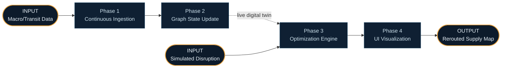
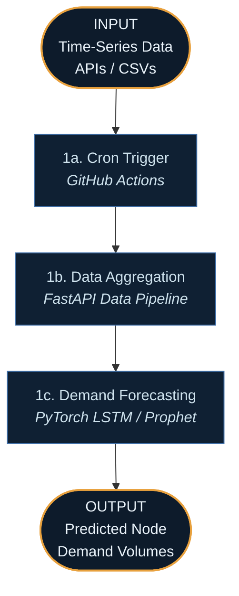
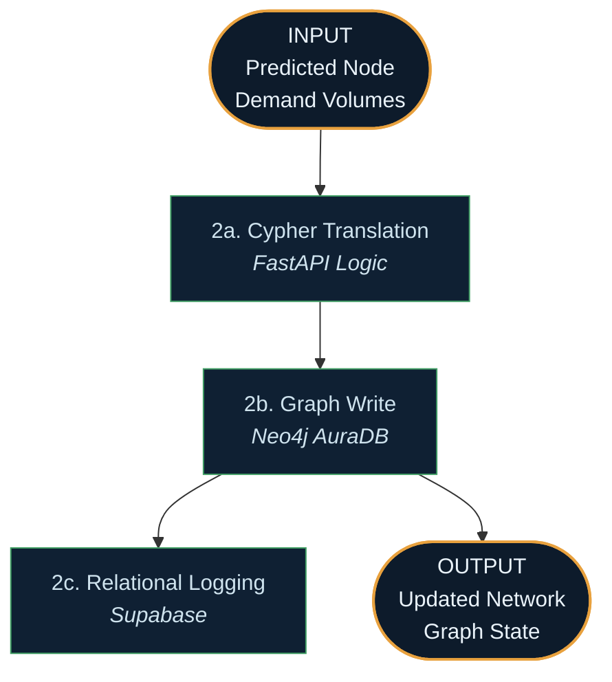
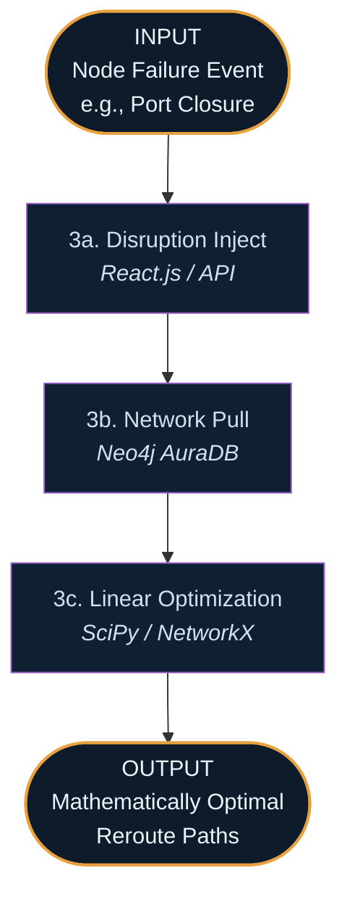
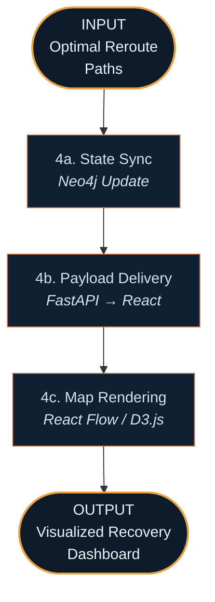
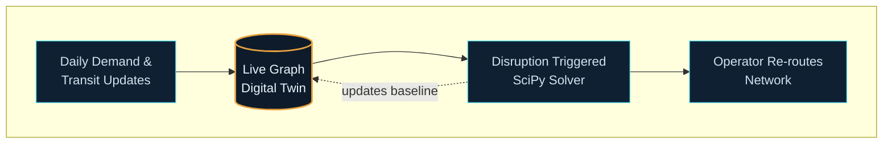

# AI for Supply Chain Resilience: Autonomous Digital Twin — System Walkthrough

This document traces how the platform behaves in practice — from the continuous ingestion of supply chain data, through the detection of a disruption, to the autonomous calculation of a new optimal routing path. Each phase below has a Mermaid diagram directly beneath its heading, with explicit **INPUT** and **OUTPUT** nodes so you can see at a glance what enters and leaves that phase.

There are **two entry points**:

1. **The Environment Path** — scheduled jobs ingest global data and update the network baseline (Phases 1–2).
2. **The Disruption Path** — a node fails, and the system autonomously rebalances the logistics network (Phases 3–4).

## Overview — How the Two Paths Connect

## PATH A — From Global Data to Digital Twin Baseline

### Phase 1 — Continuous Ingestion *(Architecture Layer 1)*

**Trigger:** A scheduled cron job runs daily to update the baseline reality of the global supply chain.

**Step 1a — Cron Trigger.** **GitHub Actions** fires a scheduled event, pinging the backend to initiate the daily data pull without needing a complex tool like Airflow.

**Step 1b — Data Aggregation.** The **FastAPI** backend fetches mock transit delays, historical sales data, and macroeconomic indicators.

**Step 1c — Demand Forecasting.** The data is fed into a lightweight **PyTorch** or Prophet time-series model to predict localized demand at various network nodes for the upcoming week.

### Phase 2 — Graph State Update *(Architecture Layer 2)*

This phase translates numerical predictions into physical relationships in the Digital Twin.

**Step 2a — Cypher Translation.** The backend maps demand forecasts and transit times into Cypher queries (e.g., updating edge weights representing transit costs).

**Step 2b — Graph Write.** **Neo4j AuraDB** updates its nodes (warehouses, ports) and edges (shipping routes). The database now perfectly mirrors current global conditions.

**Step 2c — Relational Logging.** A simple log is written to **Supabase** to maintain an audit trail of daily network changes.

## PATH B — The Disruption & Rebalancing Path

### Phase 3 — Optimization Engine *(Architecture Layer 3)*

This is the core "AI Solver" phase. It turns the system from a passive dashboard into an autonomous agent.

**Step 3a — Disruption Inject.** An operator clicks "Simulate Strike" on a specific port node in the UI, sending a disruption payload to the API.

**Step 3b — Network Pull.** The backend immediately queries **Neo4j** for the entire current graph topology, minus the offline node.

**Step 3c — Linear Optimization.** **SciPy** and **NetworkX** run a minimum-cost maximum-flow algorithm (or linear programming solver) against the graph, mathematically balancing the cheapest freight costs against the urgency of the forecasted demand.

### Phase 4 — UI Visualization *(Architecture Layer 4)*

**Step 4a — State Sync.** The new optimal routes are written back to **Neo4j** as the new active truth.

**Step 4b — Payload Delivery.** The backend sends a JSON payload containing the new edges, costs, and delays to the frontend.

**Step 4c — Map Rendering.** The **React** frontend (using React Flow or Deck.gl) animates the rerouting, visually showing the operator exactly how freight has been shifted to avoid the disruption, alongside the financial impact.

## Why the Two Paths Matter Together

A digital twin is useless if it's out of date, and optimization is useless if it runs on historical averages. 
- **Path A ensures the graph is always alive**, reflecting current macroeconomic realities.
- **Path B allows operators to instantly stress-test that reality.** 
Because the solver interacts directly with the live graph, the rerouting suggestions are mathematically actionable right now, not just theoretical planning exercises.
