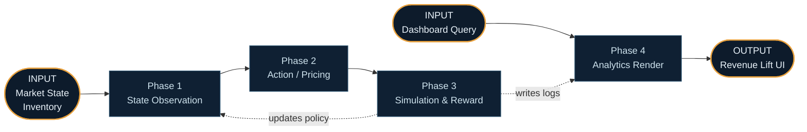
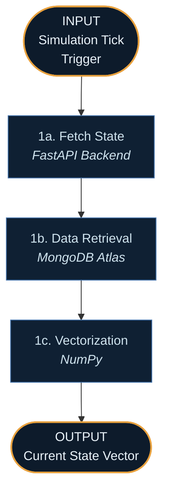
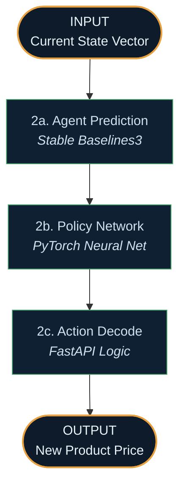
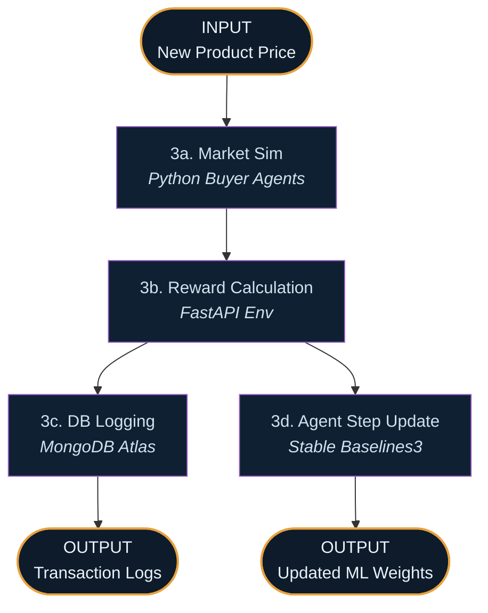
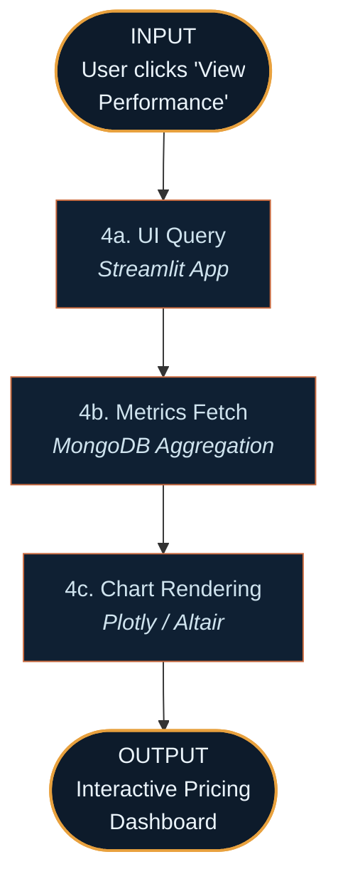
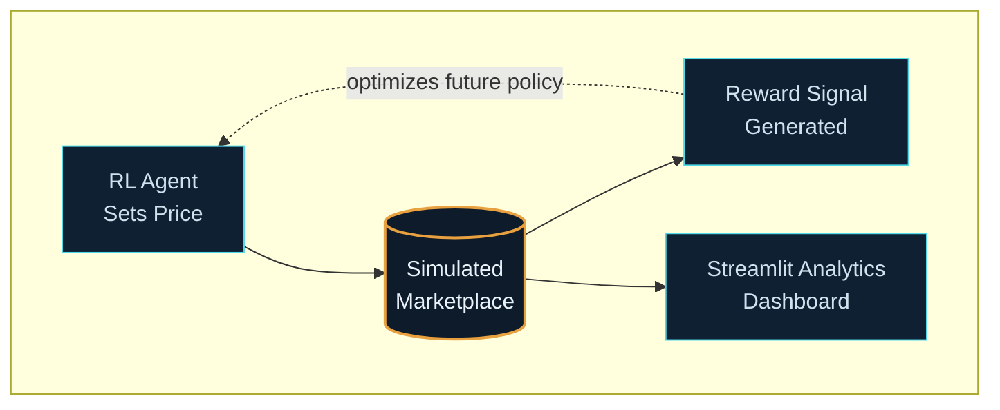

# Agentic AI for Fintech: B2B Pricing Optimization — System Walkthrough

This document traces how the platform behaves in practice — from the continuous simulated interactions in the marketplace, through the Reinforcement Learning agent's pricing decisions, to the operator's analytics view. Each phase below has a Mermaid diagram directly beneath its heading, with explicit **INPUT** and **OUTPUT** nodes so you can see at a glance what enters and leaves that phase.

There are **two entry points**:

1. **The Agent Path** — the RL agent observes the market state, sets prices, and learns from buyer behavior (Phases 1–3).
2. **The Operator Path** — a pricing strategist observes the AI's learning curve and elasticities (Phase 4).

## Overview — How the Two Paths Connect

## PATH A — From Market Observation to Pricing Action

### Phase 1 — State Observation *(Architecture Layer 1)*

**Trigger:** The simulation ticks forward by one day (or one interaction), prompting the AI to make a decision.

**Step 1a — Fetch State.** The **FastAPI** backend orchestrates the start of a new simulation step. 

**Step 1b — Data Retrieval.** The system queries **MongoDB Atlas** for the current market state: remaining inventory, days left in the financial quarter, and current competitor pricing.

**Step 1c — Vectorization.** This data is normalized into a numerical array (state vector) that the Reinforcement Learning model can mathematically process.

### Phase 2 — Action / Pricing *(Architecture Layer 2)*

This is the brain of the operation, where the agent decides how to maximize long-term reward.

**Step 2a — Agent Prediction.** The state vector is fed into a **Stable Baselines3** RL agent (e.g., PPO or DQN algorithm).

**Step 2b — Policy Network.** The underlying **PyTorch** neural network evaluates the state against its learned policy to output an action (e.g., raise price by 2%, lower by 5%, hold steady).

**Step 2c — Action Decode.** The backend translates this abstract numerical output into a concrete dollar value for the marketplace catalog.

### Phase 3 — Simulation & Reward *(Architecture Layer 3)*

The system tests the AI's decision against simulated buyers and penalizes or rewards it accordingly.

**Step 3a — Market Sim.** The new price is exposed to a simulated environment where virtual B2B buyers have randomized, hidden willingness-to-pay thresholds. Purchases occur if the price is below their threshold.

**Step 3b — Reward Calculation.** The environment calculates a reward: high positive reward for high-margin sales, negative penalties for unsold inventory accumulating holding costs.

**Step 3c — DB Logging.** The transaction outcomes, new inventory levels, and financial metrics are saved to **MongoDB Atlas**.

**Step 3d — Agent Step Update.** The agent uses the calculated reward to update its neural network weights, slowly learning the optimal pricing curve over thousands of iterations.

## PATH B — The Operator Analytics Path

### Phase 4 — Analytics Render *(Architecture Layer 4)*

**Step 4a — UI Query.** A pricing analyst opens the **Streamlit** dashboard (hosted on Streamlit Community Cloud) to review the AI's performance compared to a static baseline.

**Step 4b — Metrics Fetch.** Streamlit queries **MongoDB Atlas** for the aggregated transaction logs across epochs.

**Step 4c — Chart Rendering.** Complex data is visualized using **Plotly**, displaying the agent's learning curve, revenue lift, and real-time price elasticity graphs.

## Why the Two Paths Matter Together

Traditional pricing engines use hardcoded rules. This system learns dynamically.
- **The Agent Path (A) operates in a continuous loop,** discovering complex correlations between time, inventory, and consumer elasticity that a human would miss.
- **The Operator Path (B) guarantees transparency.** Because RL can sometimes act unpredictably, the Streamlit dashboard ensures human operators can monitor, intervene, and understand *why* the AI is pricing goods the way it is, translating "black box" math into business intelligence.
