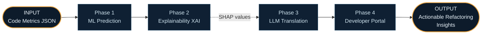
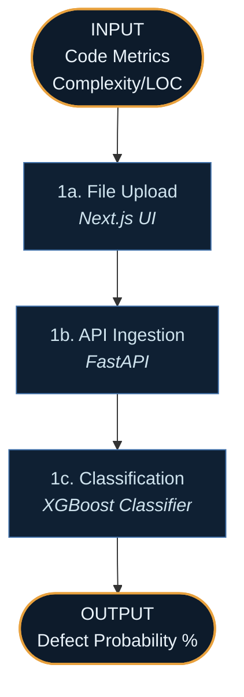
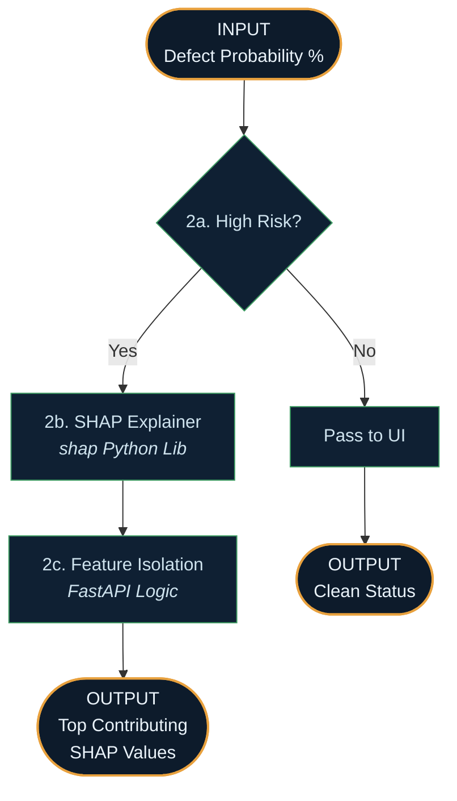
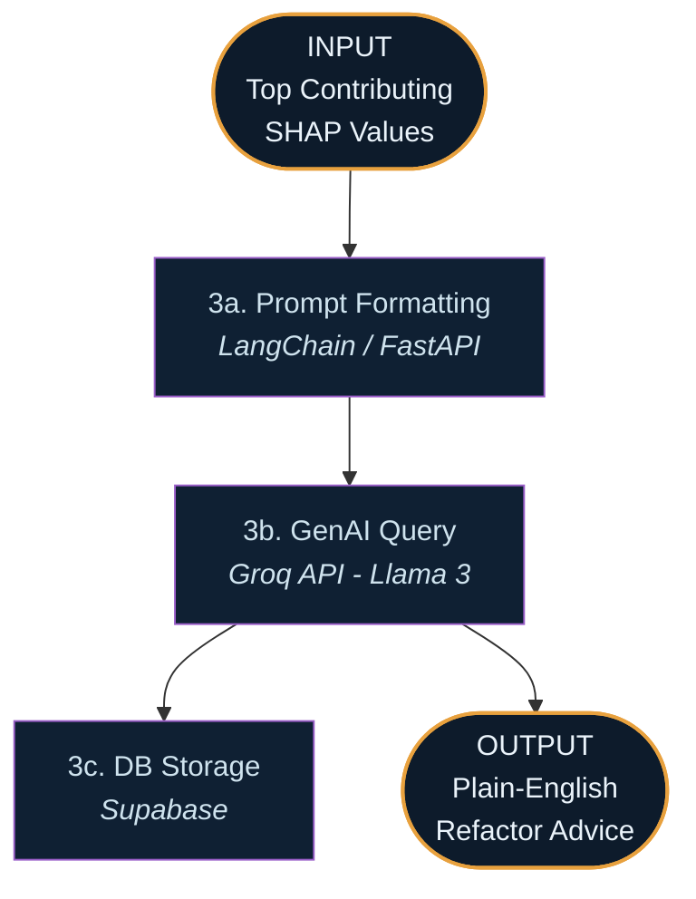
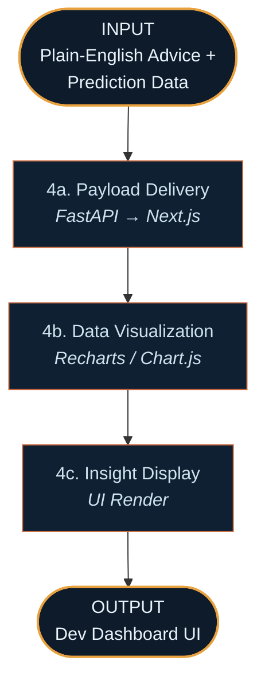
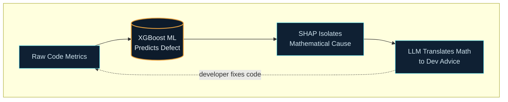

# Explainable AI for Software QA: Defect Prediction Pipeline — System Walkthrough

This document traces how the platform behaves in practice — from a developer uploading code, through ML prediction and AI explanation, to the delivery of actionable refactoring advice. Each phase below has a Mermaid diagram directly beneath its heading, with explicit **INPUT** and **OUTPUT** nodes so you can see at a glance what enters and leaves that phase.

There are **two entry points**:

1. **The Diagnostic Path** — code is analyzed, scored, and mathematically explained (Phases 1–2).
2. **The Generative Path** — math is translated into plain-English advice via LLMs and delivered to the developer (Phases 3–4).

## Overview — How the Two Paths Connect

## PATH A — From Code to Mathematical Diagnostics

### Phase 1 — ML Prediction *(Architecture Layer 1)*

**Trigger:** A developer or automated CI/CD pipeline pushes static code metrics (Lines of Code, Cyclomatic Complexity, Halstead Metrics) to the portal.

**Step 1a — File Upload.** The **Next.js** frontend captures the payload and sends it to the backend.

**Step 1b — API Ingestion.** The **FastAPI** backend (hosted on Render) receives the payload and formats it into a Pandas DataFrame.

**Step 1c — Classification.** The structured data is passed through a pre-trained **XGBoost** model which outputs a binary classification (Faulty / Clean) and a confidence probability (e.g., 88% chance of defect).

### Phase 2 — Explainability (XAI) *(Architecture Layer 2)*

This phase solves the "Black Box" problem of ML, answering *why* the model predicted a failure.

**Step 2a — Risk Check.** The system evaluates the model output. If the code is predicted "Clean," it bypasses heavy computation.

**Step 2b — SHAP Explainer.** For high-risk code, the data is passed to the **SHAP (SHapley Additive exPlanations)** library. SHAP calculates exactly how much each specific metric (e.g., complexity) contributed to the final 88% risk score.

**Step 2c — Feature Isolation.** The backend isolates the top 3 mathematical reasons for the predicted failure.

## PATH B — From Math to Actionable Insights

### Phase 3 — LLM Translation *(Architecture Layer 3)*

Developers don't want raw SHAP arrays; they want solutions. This phase translates data science into software engineering.

**Step 3a — Prompt Formatting.** The backend constructs a prompt: *"You are a senior dev. The ML model flagged this function because Cyclomatic Complexity is +4.5 over the baseline. Explain to a junior dev how to fix this."*

**Step 3b — GenAI Query.** The prompt is sent to the ultra-fast **Groq API** running open-source Llama 3, which generates actionable, contextual refactoring advice.

**Step 3c — DB Storage.** The original metrics, prediction score, and LLM advice are saved to **Supabase** for historical QA tracking.

### Phase 4 — Developer Portal *(Architecture Layer 4)*

**Step 4a — Payload Delivery.** FastAPI returns the complete analysis package to the client.

**Step 4b — Data Visualization.** The **Next.js** UI uses simple charting libraries (like Recharts) to render the SHAP values visually as a waterfall or bar chart.

**Step 4c — Insight Display.** The plain-English advice is displayed alongside the charts, giving the developer a complete, understandable diagnostic report.

## Why the Two Paths Matter Together

Without Phase 2 (SHAP), the system is just a black box yelling "Error!" at a developer. Without Phase 3 (LLM), the system is just a math tool requiring data science knowledge to interpret. 
- **Path A handles the rigorous statistical prediction.**
- **Path B handles the human-in-the-loop communication.** 
Together, they form a complete GenAI MLOps pipeline that not only finds bugs before they happen but actually coaches the developer on how to fix them.
