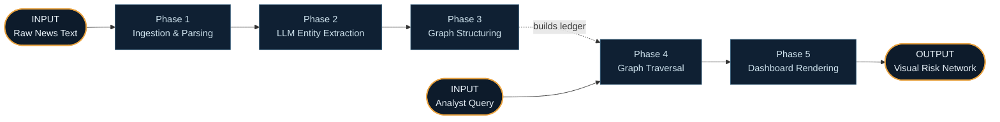
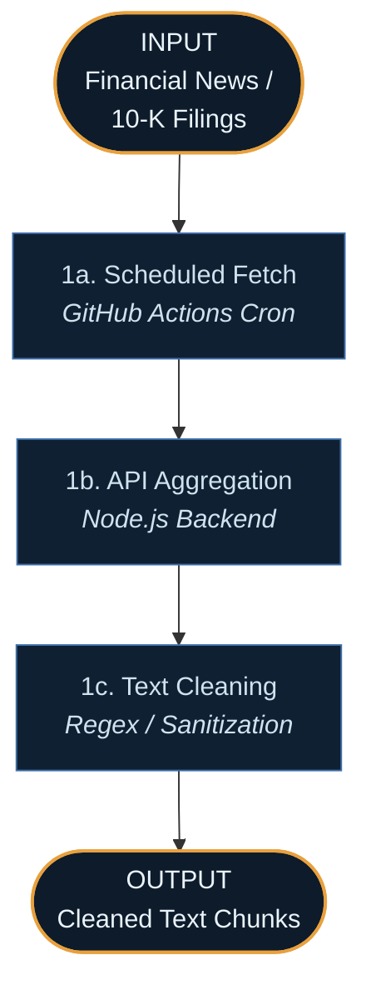
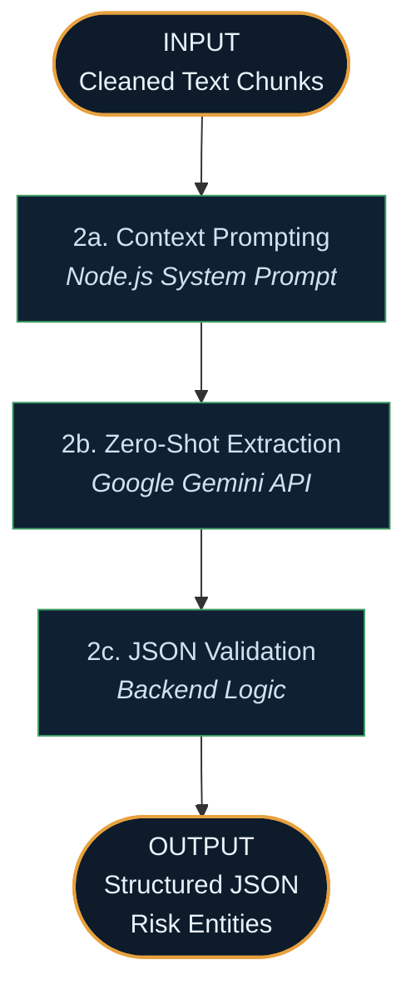
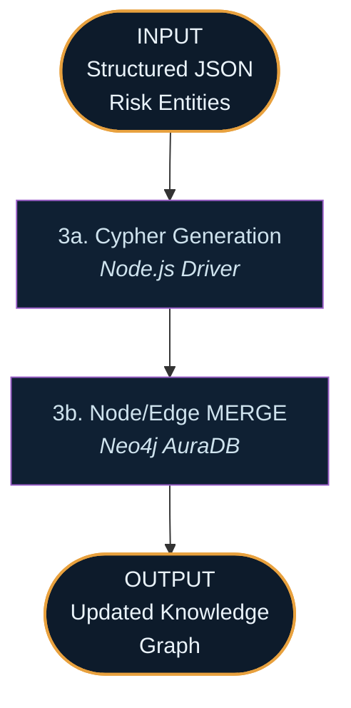
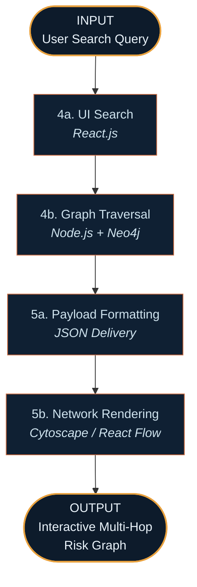
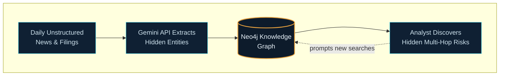

# Unstructured Data Analytics: NLP Corporate Risk Ledger — System Walkthrough

This document traces how the platform behaves in practice — from the automated ingestion of thousands of news articles, through advanced LLM entity extraction, to the moment an analyst queries a visual knowledge graph. Each phase below has a Mermaid diagram directly beneath its heading, with explicit **INPUT** and **OUTPUT** nodes so you can see at a glance what enters and leaves that phase.

There are **two entry points**:

1. **The Ingestion Path** — automated systems constantly read and structure the news (Phases 1–3).
2. **The Analyst Path** — a human user investigates a company's hidden risk topology (Phases 4–5).

## Overview — How the Two Paths Connect

## PATH A — From Raw News to Structured Knowledge Graph

### Phase 1 — Ingestion & Parsing *(Architecture Layer 1)*

**Trigger:** A daily automated process starts scanning external financial news APIs or RSS feeds.

**Step 1a — Scheduled Fetch.** A **GitHub Actions** cron job triggers the backend. This serverless approach costs nothing and requires no complex Airflow setup.

**Step 1b — API Aggregation.** The **Node.js (Express)** backend pulls articles related to specific portfolio companies.

**Step 1c — Text Cleaning.** Basic parsing removes HTML tags and boilerplate, chunking the data into sizes appropriate for LLM processing.

### Phase 2 — LLM Entity Extraction *(Architecture Layer 2)*

This is where unstructured paragraphs become structured, relational data.

**Step 2a — Context Prompting.** The Node backend formats a prompt instructing the AI to act as a forensic accountant, looking for deception cues, named executives, and litigation threats.

**Step 2b — Zero-Shot Extraction.** The **Google Gemini API** processes the text in JSON-mode. (Gemini's massive context window and high free tier make it superior here to running local HuggingFace NLP pipelines).

**Step 2c — JSON Validation.** The backend ensures the LLM output conforms to the expected schema (e.g., `{ "Entity1": "Corp X", "Relationship": "Sued_By", "Entity2": "Gov Agency", "RiskScore": 8 }`).

### Phase 3 — Graph Structuring *(Architecture Layer 3)*

Data means nothing without relationships.

**Step 3a — Cypher Generation.** The JSON objects are translated into Cypher query language commands.

**Step 3b — Node/Edge MERGE.** The queries are executed against **Neo4j AuraDB**. A new node for "Executive A" is created and linked to "Company B" with a "FACES_LITIGATION" edge. If the node already exists, the graph simply updates its properties.

## PATH B — The Analyst Investigation Path

### Phase 4 & 5 — Graph Traversal & Dashboard Rendering *(Architecture Layers 4/5)*

**Step 4a — UI Search.** A compliance officer opens the **React** dashboard and searches for a specific company or individual.

**Step 4b — Graph Traversal.** The backend executes a multi-hop graph traversal in Neo4j, pulling not just direct mentions of the company, but 2nd and 3rd-degree connections (e.g., shell companies associated with the CEO).

**Step 5a/5b — Rendering.** The data is returned and visualized using graph libraries like **React Flow**. The analyst visually sees a web of hidden connections and risk scores that a standard SQL table could never intuitively display.

## Why the Two Paths Matter Together

Traditional financial analysis relies on structured numbers (P&L, balance sheets). Corporate fraud and hidden risks live in the text.
- **Path A operates continuously,** reading thousands of pages a human analyst could never get through, turning text into math.
- **Path B allows humans to intuitively interact with that math.** 
The graph database is the magic in the middle, storing relationships rather than just rows, making invisible structural risks instantly visible.
