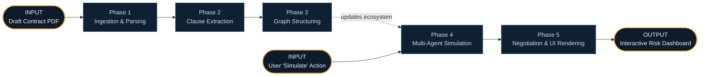
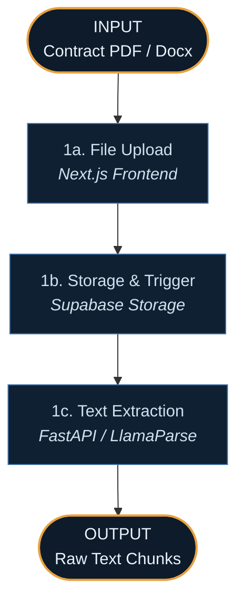
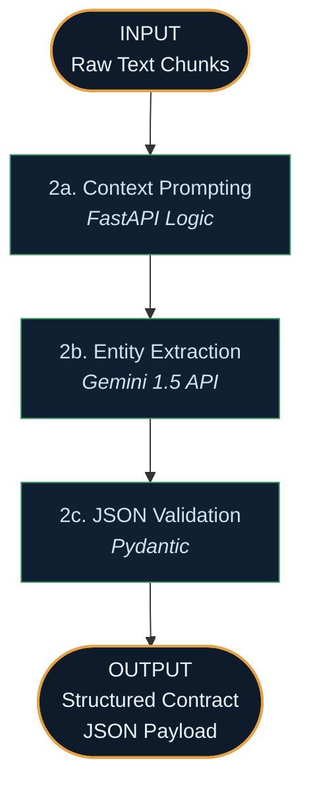
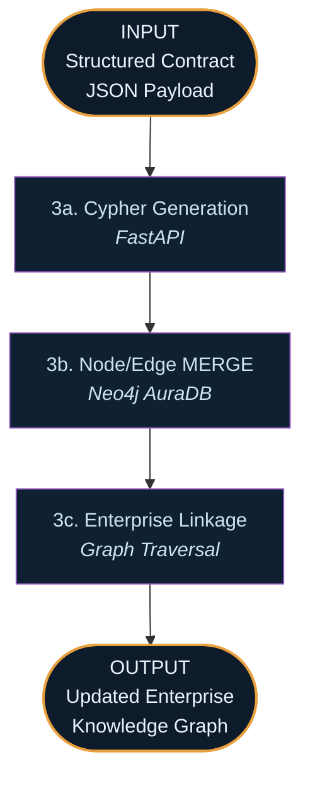
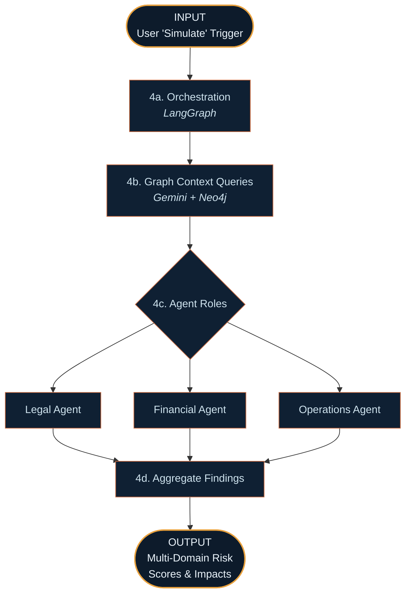
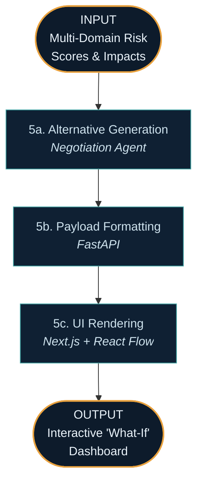
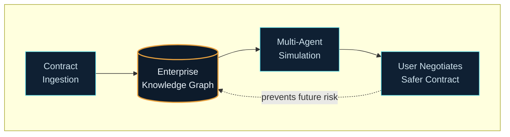

# Context-Aware Multi-Agent AI System for Dynamic Contract Risk Prediction — System Walkthrough

This document traces how the platform behaves in practice — from the moment a new contract is uploaded, through knowledge graph structuring, to the execution of a multi-agent simulation that predicts cascading enterprise risks. Each phase below has a Mermaid diagram directly beneath its heading, with explicit **INPUT** and **OUTPUT** nodes so you can see at a glance what enters and leaves that phase.

There are **two entry points**:

1. **The Ingestion Path** — a draft contract is uploaded, parsed, and mapped into the enterprise ecosystem (Phases 1–3).
2. **The Simulation Path** — specialized AI agents simulate the real-world operational and financial impacts of the contract before execution (Phases 4–5).

---

## Overview — How the Two Paths Connect

---

## PATH A — From Raw Contract to Enterprise Knowledge Graph

### Phase 1 — Ingestion & Parsing *(Architecture Layer 1)*

**Trigger:** A legal or procurement officer uploads a draft supplier contract into the portal.

**Step 1a — File Upload.** The **Next.js** frontend captures the document and passes it to the backend architecture.
**Step 1b — Storage.** The file is securely stored in **Supabase Storage**.
**Step 1c — Text Extraction.** A **FastAPI** backend (hosted on Render) utilizes LlamaParse or basic PDF extractors to strip out boilerplate and chunk the text into logical sections, preserving tables and SLA metrics.

---

### Phase 2 — LLM Clause & Entity Extraction *(Architecture Layer 2)*

Here, unstructured legalese is translated into structured business data.

**Step 2a — Context Prompting.** The backend constructs prompts designed to isolate specific entities: supplier names, delivery timelines, penalty percentages, and governing jurisdictions.
**Step 2b — Entity Extraction.** The **Google Gemini 1.5 API** processes the chunks in JSON mode. Its massive context window allows it to process the entire contract simultaneously without losing references.
**Step 2c — JSON Validation.** **Pydantic** validates that the LLM output conforms to the required data schema before passing it to the database.

---

### Phase 3 — Knowledge Graph Structuring *(Architecture Layer 3)*

This is the key differentiator from standard contract AI. The contract is not analyzed in a vacuum; it is wired into the company's nervous system.

**Step 3a — Cypher Generation.** The JSON data is translated into Cypher queries.
**Step 3b — Node/Edge MERGE.** Nodes (e.g., "Supplier A", "Delivery Clause") and Edges (e.g., "TRIGGERS_PENALTY") are written into **Neo4j AuraDB**.
**Step 3c — Enterprise Linkage.** The database automatically links this new contract to existing nodes—for instance, linking "Supplier A's" raw material delivery to "Customer B's" finalized product commitments.

---

## PATH B — Multi-Agent Risk Simulation

### Phase 4 — Multi-Agent Reasoning *(Architecture Layer 4)*

**Step 4a — Orchestration.** A user clicks "Simulate Risk." **LangGraph** initializes a multi-agent workflow.
**Step 4b — Context Queries.** The orchestrator pulls the cascading graph data from Neo4j (e.g., "Supplier A is 3 hops away from Customer B").
**Step 4c — Agent Roles.** 
*   **Legal Agent** reviews standard compliance.
*   **Operations Agent** sees that a 10-day delay allowed in this contract will cause a stockout on the assembly line.
*   **Financial Agent** calculates that the assembly line stockout will trigger a $50,000 SLA penalty with Customer B.
**Step 4d — Aggregate Findings.** LangGraph compiles the diverse perspectives into a single unified risk report.

---

### Phase 5 — Negotiation & UI Rendering *(Architecture Layer 5)*

**Step 5a — Alternative Generation.** Before showing the user the problem, a **Negotiation Agent** (powered by Gemini) drafts alternative clause text (e.g., tightening the delivery window to 5 days) to neutralize the cascading risk.
**Step 5b/c — Rendering.** The backend sends the full simulation to **Next.js**. The user sees a visual network graph of how the risk cascades through the enterprise, accompanied by plain-English rewrite suggestions to fix it.

---

## Why the Two Paths Matter Together

Traditional tools just check if a clause is missing. This architecture predicts the future.
- **Path A builds the interconnected reality** of the business, ensuring no contract exists in a vacuum.
- **Path B unleashes specialized AI agents** onto that reality, allowing them to debate and calculate cascading consequences before a human signs a flawed document, saving millions in hidden operational liabilities.
