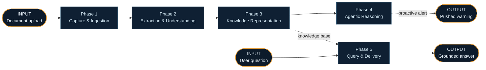
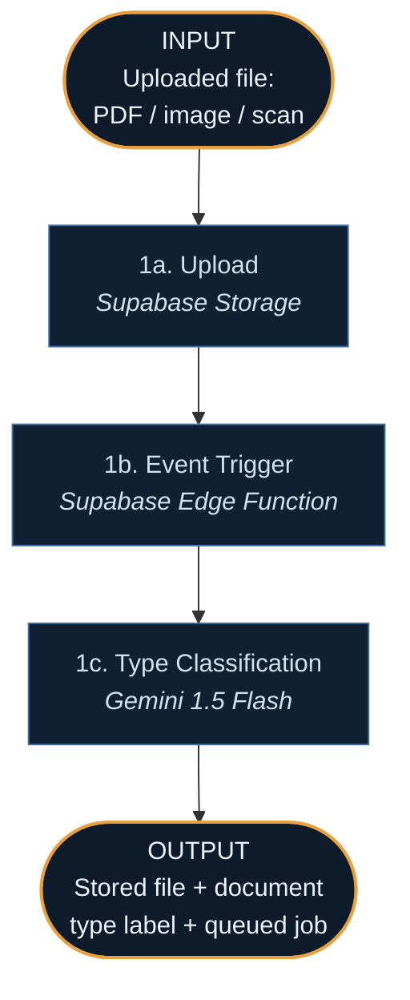
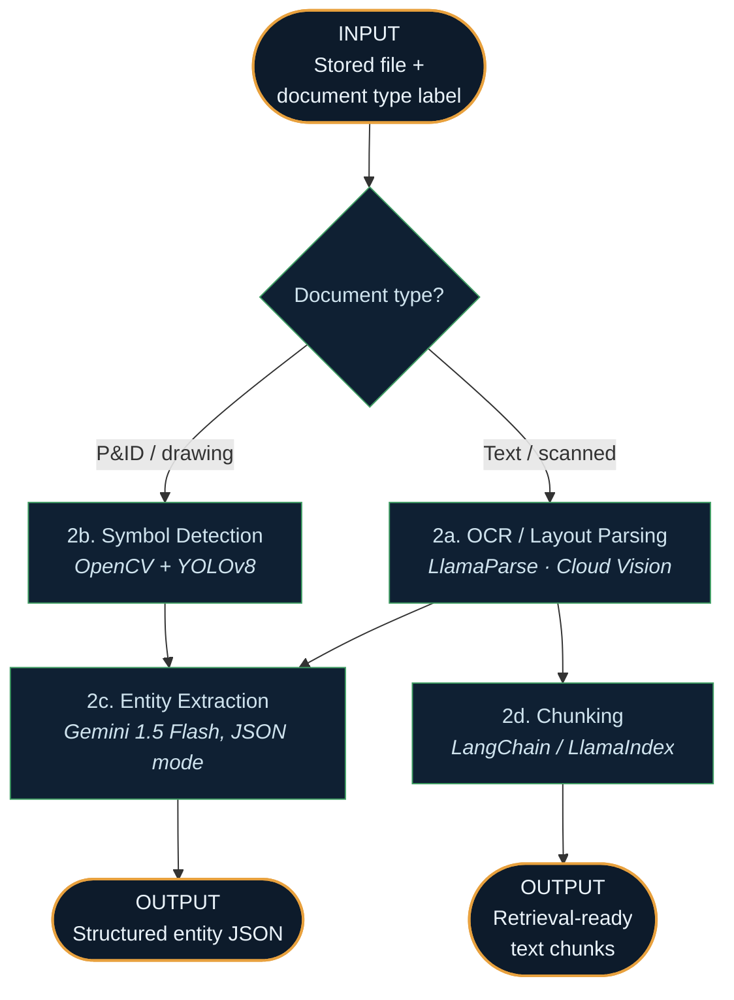
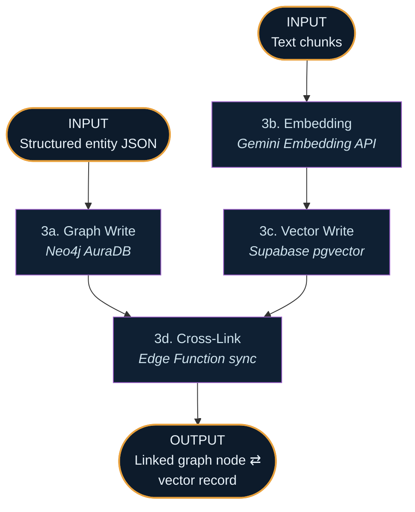
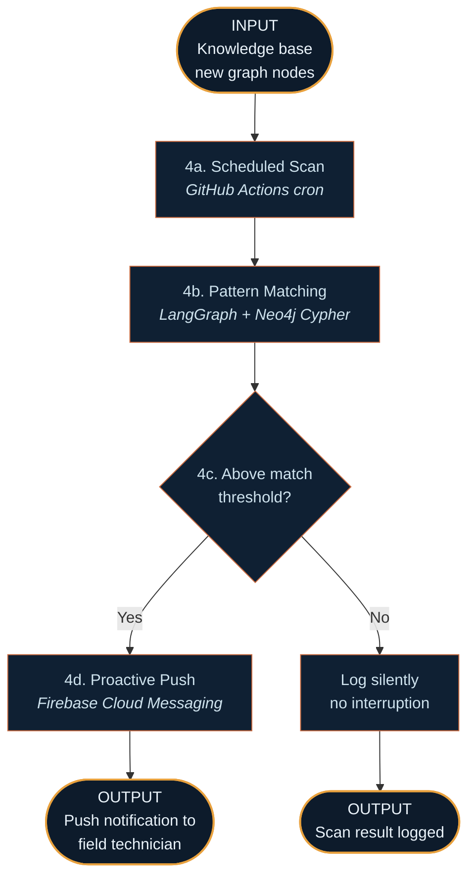
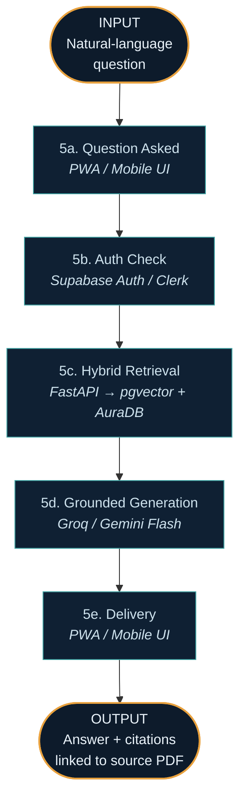
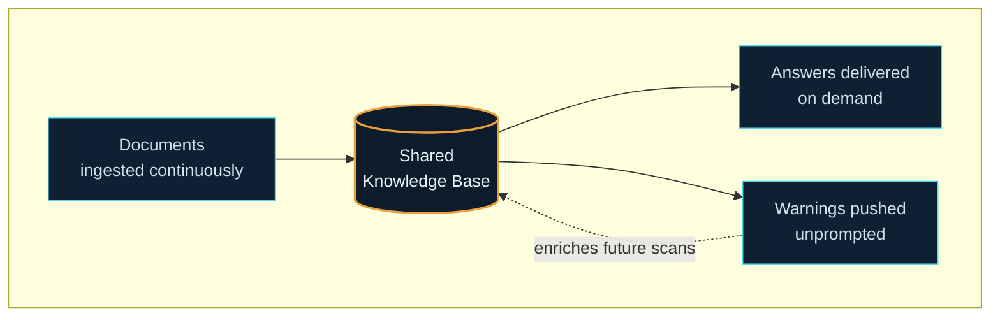

# Industrial Knowledge Intelligence — System Walkthrough

This document traces how the platform behaves in practice — from the moment a document enters the system, through processing and storage, to the moment a person receives an answer (or a warning they never had to ask for). Each phase below has a Mermaid diagram directly beneath its heading, with explicit **INPUT** and **OUTPUT** nodes so you can see at a glance what enters and leaves that phase.

There are **two entry points**:

1. **The document path** — something is uploaded, and the system has to understand it (Phases 1–4).
2. **The question path** — a person asks something, and the system has to answer it (Phase 5).

Both paths share the same underlying knowledge base — nothing is ever answered from one document in isolation, but from everything the system has learned so far.

---

## Overview — How the Two Paths Connect

---

## PATH A — From Uploaded Document to Stored Knowledge

### Phase 1 — Capture & Ingestion *(Architecture Layer 1)*

**Trigger:** An engineer, inspector, or automated feed uploads a file — an inspection report, work order, scanned form, or engineering drawing.

**Step 1a — Upload.** The file lands in **Supabase Storage**, the single front door for all raw files, whether from a person dragging in a PDF or an automated export from another system. The upload returns a stored object URL.

**Step 1b — Event Trigger.** The moment the file is written, a **Supabase Edge Function** fires automatically. Nothing polls a folder; nothing waits for a scheduled job. This is what makes the pipeline event-driven rather than batch-processed.

**Step 1c — Type Classification.** A fast pass through **Gemini 1.5 Flash** tags what kind of document this is — P&ID, inspection report, work order, email. This label determines which processing path it takes next.

---

### Phase 2 — Extraction & Understanding *(Architecture Layer 2)*

This is where unstructured content — pixels, scanned handwriting, freeform text — becomes structured, queryable facts.

**Step 2a — OCR / Layout Parsing.** Text-heavy PDFs go to **LlamaParse**, which preserves layout — tables stay tables, headers stay headers. Scanned or handwritten pages go to **Google Cloud Vision**, stronger on messy, non-digital-native input.

**Step 2b — Drawing / Symbol Detection.** For P&IDs specifically: **OpenCV** cleans up lines and contours, then **YOLOv8** detects and classifies symbols — valves, pumps, instruments — recording their coordinates on the page.

**Step 2c — Entity Extraction.** Text from 2a (or tag-reading from 2b) is sent to **Gemini 1.5 Flash in JSON mode**, turning freeform description into typed fields: equipment tag, inspector name, date, finding, severity. This is the handoff point from "text" to "facts."

**Step 2d — Chunking.** In parallel, the full text is split into semantically coherent chunks via **LangChain / LlamaIndex**, preserving narrative detail that structured extraction alone would lose.

---

### Phase 3 — Knowledge Representation *(Architecture Layer 3)*

This layer gives the platform its actual intelligence advantage — the difference between "a folder of processed PDFs" and a system that connects facts across documents.

**Step 3a — Graph Write.** Entity JSON becomes nodes and edges in **Neo4j AuraDB**: `Equipment → HAS_FINDING → Inspection → PERFORMED_BY → Inspector`. This relationship structure is what later lets the RCA agent trace a failure back through every prior touchpoint with that equipment.

**Step 3b — Embedding.** Text chunks are converted into dense vector embeddings via the **Gemini Embedding API** — capturing meaning, not just keywords, so "leak" also surfaces a document that said "seepage."

**Step 3c — Vector Write.** Embeddings are stored in **Supabase pgvector** alongside metadata (document type, date, equipment tag), enabling hybrid search — semantic similarity filtered by structured criteria.

**Step 3d — Cross-Link.** An Edge Function tags every vector row with its corresponding graph node ID, and vice versa. Without this link, the graph and vector store would be two disconnected systems instead of one unified knowledge base.

---

### Phase 4 — Agentic Reasoning *(Architecture Layer 4)*

Unlike Phases 1–3, this phase doesn't run *because* a document arrived — it runs on its own schedule, continuously watching the knowledge base for patterns. This is what makes the platform proactive rather than purely reactive.

**Step 4a — Scheduled Scan.** A **GitHub Actions cron job** wakes the Lessons Learned agent on a fixed interval, which pulls every graph node added since its last run.

**Step 4b — Pattern Matching.** Each new finding is compared against historical failure patterns via **LangGraph**-orchestrated Cypher queries against **Neo4j** — matching on equipment class, symptom language, or recurring root causes.

**Step 4c — Decision Branch.** Above threshold → escalate. Below threshold → log silently, no interruption. This threshold matters: a system that alerts on everything trains people to ignore it.

**Step 4d — Proactive Push.** For an escalated match, the LLM generates a plain-language warning and **Firebase Cloud Messaging** pushes it directly to the relevant technician's device — before anyone asked.

*Note: the other three agents — Expert Knowledge Copilot, Maintenance & RCA Agent, Compliance Intelligence — share this layer's orchestration runtime (LangGraph/CrewAI, Gemini Flash + Groq) but are query-triggered rather than schedule-triggered. The Copilot's path is traced in Phase 5.*

---

## PATH B — From a Person's Question to a Grounded Answer

### Phase 5 — Query & Delivery *(Architecture Layer 5)*

This is the path a person actually experiences — it can run completely independently of Phases 1–4 having just fired, querying whatever is already in the knowledge base.

**Step 5a — Question Asked.** A field technician opens the **PWA** (or an engineer uses the desktop app) and asks something in plain language — e.g. *"Any known issues with Pump P-204?"*

**Step 5b — Auth Check.** **Supabase Auth / Clerk** authenticates the request and scopes what the person can see, before any retrieval happens — access control is enforced at the door, not filtered after the fact.

**Step 5c — Hybrid Retrieval.** The **FastAPI backend** runs a semantic search against **pgvector** and a graph traversal in **Neo4j** simultaneously — the payoff of Phase 3's cross-linking. The system finds not just a paragraph mentioning "Pump P-204," but everything connected to it.

**Step 5d — Grounded Generation.** Retrieved context is handed to **Groq** (speed) or **Gemini Flash**, instructed to answer only from what was retrieved and cite sources — reasoning from this plant's actual history, not general knowledge.

**Step 5e — Delivery.** The answer displays with citations linking directly back to the original document in Supabase Storage — the technician can verify, not just trust.

---

## Why the Two Paths Matter Together

The reason this is a "Unified Asset & Operations Brain" and not a chatbot bolted onto a filing cabinet: **Path A never stops running while Path B is being used.** Every new document ingested through Phases 1–3 immediately becomes part of what Phase 5 can retrieve from, and immediately becomes something Phase 4 can pattern-match against for the *next* technician's proactive warning.

- **Documents go in continuously** (Path A) → the knowledge graph and vector store get richer with every upload.
- **Answers come out on demand** (Path B) → grounded in everything that's ever gone in.
- **Warnings come out unprompted** (Path A, Phase 4) → the system continuously compares new information against old patterns, even when nobody's asking.

That continuous loop — ingest, understand, connect, watch, answer — is what both diagrams describe from two angles: the architecture shows *what the system is made of*; this workflow shows *what it actually does, in order*, every time a document arrives or a question gets asked.
